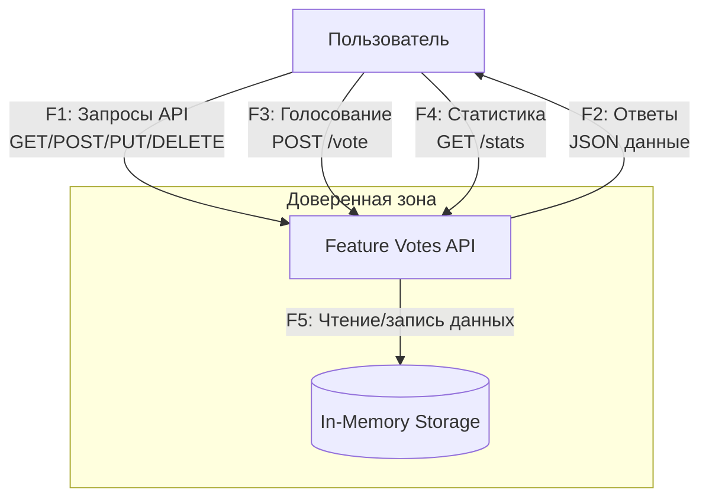
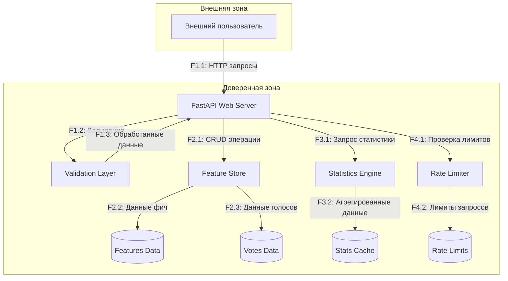
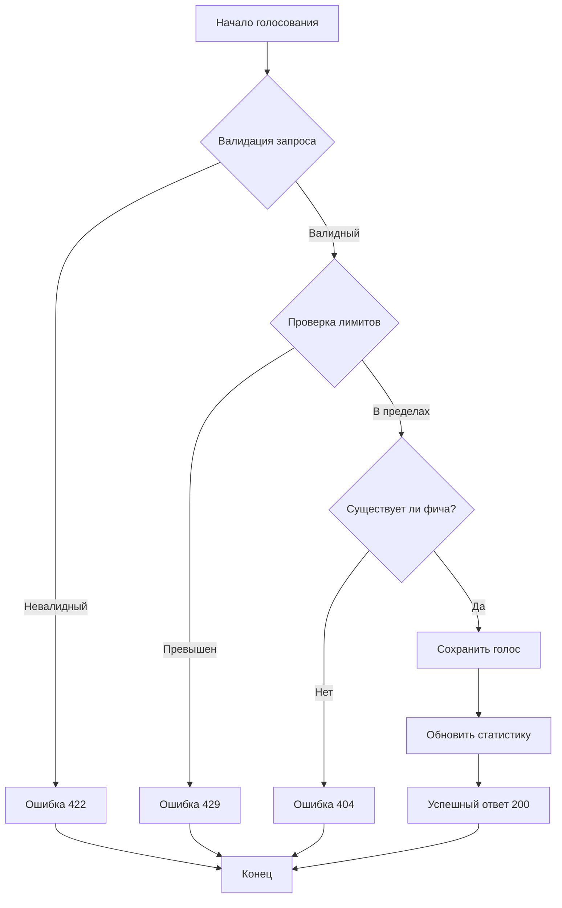
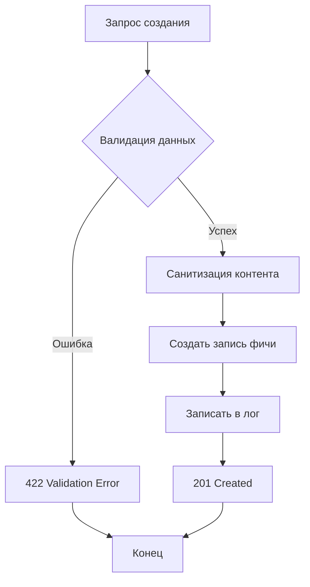

# Data Flow Diagram (DFD) for Feature Votes System

## Контекстная диаграмма (Уровень 0)

**Описание потоков уровня 0**:
- F1: Управление фичами (создание, просмотр, обновление, удаление)
- F2: Ответы API в формате JSON
- F3: Операции голосования за фичи
- F4: Запросы статистики и аналитики
- F5: Внутренние операции с данными

## Логическая архитектура (Уровень 1)

**Описание компонентов уровня 1**:

- WEB: FastAPI веб-сервер (обработка HTTP запросов)
- VALID: Слой валидации (проверка входных данных)
- STORE: Менеджер хранения (CRUD операции)
- STATS: Движок статистики (агрегация данных)
- RATE: Ограничитель запросов (защита от DoS)

**Потоки данных уровня 1**:

- F1.1: Входящие HTTP запросы от пользователей
- F1.2: Валидация параметров и payload
- F1.3: Очищенные и проверенные данные
- F2.1: Операции с хранилищем (create, read, update, delete)
- F2.2: Данные фич (название, описание, метаданные)
- F2.3: Данные голосов (user_id, feature_id, значение, timestamp)
- F3.1: Запросы расчетов статистики
- F3.2: Кэшированные результаты статистики
- F4.1: Проверка ограничений частоты запросов
- F4.2: Хранение счетчиков запросов

## Диаграмма процессов обработки ключевых операций (Уровень 2)

### Процесс голосования

### Процесс создания фичи

### Trust Boundaries

**Основные границы**:

1) Внешняя граница: Пользователь ↔ API
- Недоверенные входные данные
- Требуется валидация и санитизация

2) Внутренняя граница: Компоненты приложения
- Доверенная коммуникация
- Контроль целостности данных

**Ключевые точки безопасности**:

- F1.1: Входная валидация (XSS, SQL injection protection)
- F4.1: Rate limiting (DoS protection)
- F2.1: Авторизация операций (если будет реализована)
- F1.2: Санитизация данных (HTML/JS escaping)

### Связь с компонентами кода

| DFD Компонент | Файл в коде           | Реализация                     |
|---------------|-----------------------|--------------------------------|
| WEB           | app/main.py           | FastAPI приложение             |
| VALID         | app/features/models.py | Pydantic модели               |
| STORE         | app/features/store.py | FeatureStore класс            |
| STATS         | app/features/routes.py | Эндпоинт /stats               |
| RATE          | app/main.py, app/features/routes.py | @limiter декораторы |
| MEM_*         | В памяти Python       | Словари и списки              |
